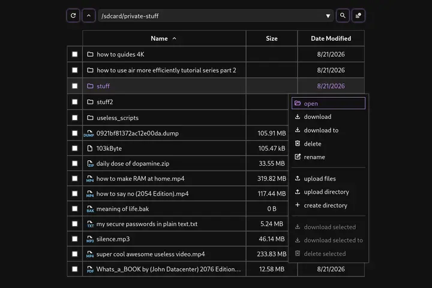

# ADB Explorer

A cross-platform desktop app for file transfer and management between PC and Android mobile devices. It uses the Android Debug Bridge (ADB) protocol for communication. After the initial start of the ADB server it uses a native Go ADB client library to interact with the protocol, thereby avoid spawning redundant subprocesses. The application supports all fundamental file management operations.



## Getting Started

- Download [latest release](https://github.com/syeero7/adb-explorer/releases/latest)
- Enable USB debugging
    - Settings > Software Information
    - Tap `build number` few times to turn on developer options
    - Go to developer options and turn on USB debugging
- Connect Android device to the PC via USB and press start
- Authorize ADB access

### Build from Source

Install wails v2 and required dependencies. [Walis docs](https://wails.io/docs/gettingstarted/installation/)

Clone the repository

```bash
git clone https://github.com/syeero7/adb-explorer
cd adb-explorer
```

Compile the binary

```bash
# linux
wails build -upx -trimpath -platform=linux

# windows
wails build -upx -trimpath -platform=windows
```

## Local Development

Install wails and required dependencies. [Walis docs](https://wails.io/docs/gettingstarted/installation/)

```bash
# Initialize go workspace
go work init .

# Add local Wails module to the workspace
go work use /home/<username>/go/pkg/mod/github.com/wailsapp/wails/<wails_version>

wails dev
```
